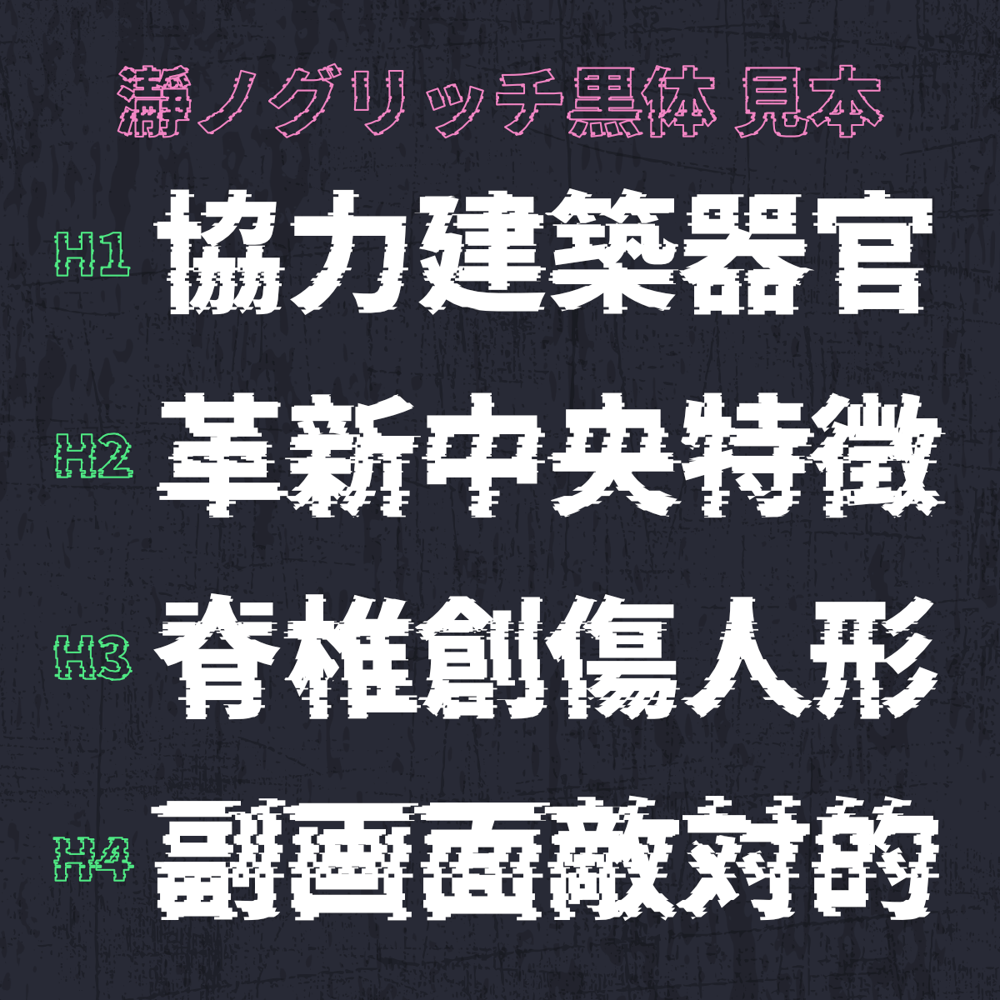
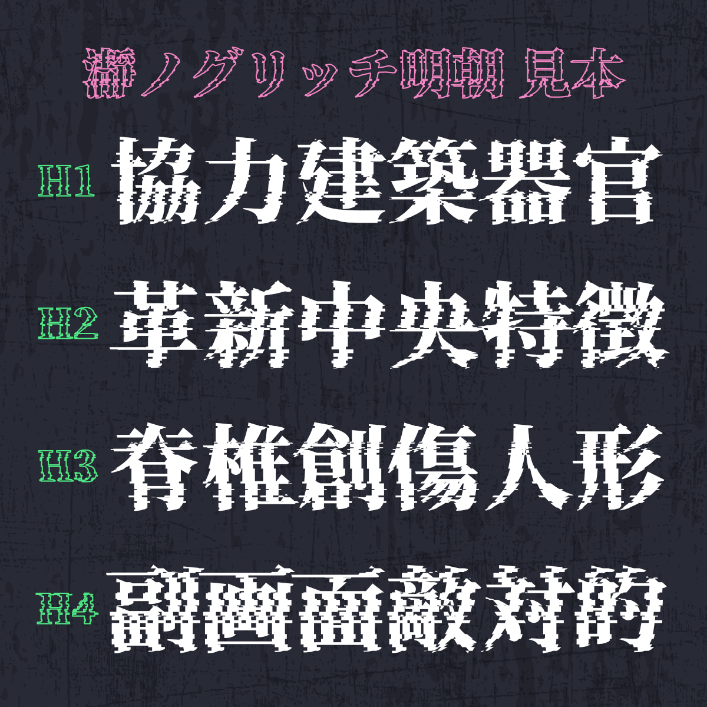

# 瀞ノグリッチ黒体 / 瀞ノグリッチ明朝

## フォントについて

- 本フォントは源ノ角ゴシック、源ノ明朝を改変し、グリッチの効いたフォントに加工した書体です。
- 読み方は「とろのぐりっちこくたい」「とろのぐりっちみんちょう」です。

## 配布ファイル

- 瀞ノグリッチ黒体(H1, H2, H3, H4)
- 瀞ノグリッチ明朝(H1, H2, H3, H4)

## ベースフォント

- [源ノ角ゴシック JP V2.001](https://github.com/adobe-fonts/source-han-sans/tree/release)
- [源ノ明朝 JP V1.001](https://github.com/adobe-fonts/source-han-serif/tree/release)

## 注意事項

- 源ノ角ゴシック/源ノ明朝のライセンスに準じ、[SIL Open Font License](https://scripts.sil.org/cms/scripts/page.php?site_id=nrsi&id=OFL_web)で公開しています。
- 本フォントを利用したことによって発生したいかなる故障・損害についても責任を負いません。
- 機械的に処理している関係上、一部にパスが崩れたグリフ・空白になっているグリフがあります。あらかじめご了承ください。

## 作者

あまずさ鴒 (Amazusa Rei)

- E-Mail: amazusa0@gmail.com
- Twitter: @AmazusaRei

## 更新履歴

- 2021/06/17  瀞ノグリッチ黒体 ver1.0   公開
- 2021/07/17  瀞ノグリッチ明朝 ver1.0   公開
